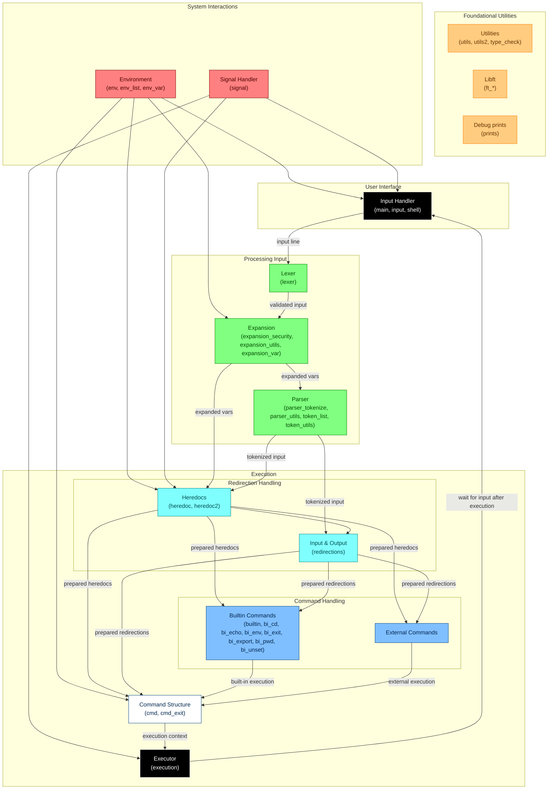

# minishell

[42-Cursus] Minishell is a minimalist shell implementation written in C, designed to mimic basic functionalities of a Unix shell like Bash. This project focuses on understanding processes, file descriptors, and shell operations such as command execution, redirections, pipes, and signal handling.

Keywords

- **Shell**
- **Process Management**
- **File Descriptors**
- **Redirections**
- **Pipes**
- **Signal Handling**
- **Built-in Commands**
- **Environment Variables**

---

## Index

- [Overview](#overview)
- [Features](#features)
- [Requirements](#requirements)
- [Flowchart](#flowchart)
- [How to Run](#how-to-run)
- [Parser Example](#parser-example)
- [Tests](#tests)
  - [Commands in Interactive Mode](#commands-in-interactive-mode)
  - [Non-Interactive Mode](#non-interactive-mode)
  - [Redirections](#redirections)
  - [Environment Variables](#environment-variables)
  - [Single and Double Quotes](#single-and-double-quotes)
  - [Variable Expansion and Quotes Combination](#variable-expansion-and-quotes-combination)
  - [Heredocs with Quoted Limiters](#heredocs-with-quoted-limiters)
  - [Built-in Commands](#built-in-commands)
  - [Error Handling](#error-handling)
  - [Signals](#signals)
  - [SHLVL (Shell Level)](#shlvl-shell-level)
- [What I Learned](#what-i-learned)
- [Authors](#authors)
- [Acknowledgments](#acknowledgments)
---

## Overview

Minishell is a simplified Unix shell implementation created as part of the 42 Cursus curriculum. The project aims to deepen understanding of core operating system concepts such as process management, file descriptors, and shell operations. Minishell supports basic shell functionalities like command execution, input/output redirection, pipes, and environment variable management. It also handles signals like `ctrl-C`, `ctrl-D`, and `ctrl-\` similar to Bash.

The project is written in C and adheres to strict coding standards, ensuring no memory leaks and robust error handling. Minishell is a great way to explore the inner workings of a shell and gain hands-on experience with low-level system programming.

---

## Features

- **Command Execution**: Executes commands based on the `PATH` variable or using relative/absolute paths.
- **Input/Output Redirection**: Supports `<`, `>`, `<<`, and `>>` for input/output redirection.
- **Pipes**: Implements pipes (`|`) to connect the output of one command to the input of another.
- **Environment Variables**: Expands environment variables (e.g., `$HOME`) and `$?` for the exit status of the last command.
- **Signal Handling**: Handles `ctrl-C`, `ctrl-D`, and `ctrl-\` as in Bash.
- **Built-in Commands**: Implements built-ins like `echo`, `cd`, `pwd`, `export`, `unset`, `env`, and `exit`.
- **Quoting**: Handles single (`'`) and double (`"`) quotes to prevent interpretation of metacaracters.

## Bonus Features (Not implemented)

- **Logical Operators**: Supports `&&` and `||` with parentheses for priority.
- **Wildcards**: Implements `*` wildcard for the current directory.

---

## Requirements

- The project must be written in C and follow the 42 Norm.
- No memory leaks are allowed.
- The shell must handle signals correctly and manage file descriptors properly.
- The Makefile must compile the project with `-Wall`, `-Werror`, and `-Wextra` flags.
- The shell must support the mandatory features listed in the subject.

---

## Flowchart

Below is the flowchart representing the architecture and flow of the Minishell project.

> **Note**: This flowchart is an approximation and may not represent the exact implementation details.



---

## How to Run

1. Clone this repository:

   ```bash
   git clone [repository-url]
   cd minishell
   ```

2. Compile the project:

   ```bash
   make
   ```

3. Run the shell:

   ```bash
   ./minishell
   ```

## Parser Example

Input:

```C
cat < in | grep "Hi bye" | grep 'H' > out | cat >> final_out -e
```

Tokenizer result and classification:

- `"cat"`: command
- `"<"`: redir_in
- `"in"`: file_path
- `"|"`: op_pipe
- `"grep"`: command
- `"Hi bye"`: argument
- `"|"`: op_pipe
- `"grep"`: command
- `"H"`: argument
- `">"`: redir_out
- `"out"`: file_path
- `"|"`: op_pipe
- `"cat"`: command
- `">>"`: redir_append
- `"final_out"`: file_path
- `"-e"`: argument

---

## Tests

### **Commands in Interactive Mode**

| **Input Command**                     | **Description**                                   | **Expected Output**                          |
|---------------------------------------|---------------------------------------------------|----------------------------------------------|
| `echo "Hello"`                        | Prints "Hello" in interactive mode.               | `Hello`                                      |
| `ls`                                  | Lists files in the current directory.             | List of files.                               |
| `echo "Hello" \| grep "H" \| wc -l`   | Pipes "Hello" through `grep` and counts lines.    | `1`                                          |
| `ls -la \| grep "txt" \| wc -l`       | Lists files, filters `.txt` files, and counts them. | Number of `.txt` files.                     |
| `cat < input.txt \| grep "pattern" \| wc -l` | Reads from `input.txt`, filters lines with "pattern", and counts them. | Number of matching lines.            |

### **Non-Interactive Mode**

| **Input Command**                     | **Description**                                   | **Expected Output**                          |
|---------------------------------------|---------------------------------------------------|----------------------------------------------|
| `echo "Hello" \| ./minishell`          | Pipes "Hello" into Minishell in non-interactive mode. | `Hello`                                  |
| `ls \| ./minishell`                    | Pipes `ls` output into Minishell.                 | List of files.                               |
| `echo "exit 42" \| ./minishell`        | Exits Minishell with status `42`.                 | Shell exits with code `42`.                  |
| `echo "invalid_command" \| ./minishell` | Runs an invalid command in non-interactive mode. | `Error: command not found`, exit code `127`. |
| `echo "echo $SHLVL" \| ./minishell`    | Prints the shell level in non-interactive mode.   | `1` (or incremented value if nested).        |

### **Redirections**

| **Input Command**                             | **Description**                                          | **Expected Output**                                              |
| --------------------------------------------- | -------------------------------------------------------- | ---------------------------------------------------------------- |
| `cat < input.txt > output.txt`                | Reads from `input.txt` and writes to `output.txt`.       | No output, but `output.txt` contains the content of `input.txt`. |
| `echo "Hello" > file.txt \| cat < file.txt`   | Writes "Hello" to `file.txt` and reads it back.          | `Hello`                                                          |
| `echo "Hello" >> file.txt \| cat < file.txt`  | Appends "Hello" to `file.txt` and reads it back.         | `Hello` appended to the existing content.                        |
| `grep "pattern" < input.txt > output.txt`     | Filters lines with "pattern" and writes to `output.txt`. | No output, but `output.txt` contains matching lines.             |
| `cat << EOF > output.txt`<br>`Hello`<br>`EOF` | Writes "Hello" to `output.txt` using a heredoc.          | No output, but `output.txt` contains `Hello`.                    |
| `cat << EOF \| cat << EOL`<br>`Hello`<br>`EOF`<br>`World`<br>`EOL` | Uses nested heredocs to try write "Hello" and "World". Only the last word  is saved.       | `World`, the result is piped, and both heredoc contents are processed. |
| `cat <<1 <<2 <<3 \| tee out`<br>`First`<br>`1`<br>`Second`<br>`2`<br>`Third`<br>`3` | Uses multiple nested heredocs. Only the last one is saved, but all are processed. | `Third`, `out` contains `Third` only. |

### **Environment Variables**

| **Input Command**                                  | **Description**                            | **Expected Output**           |
| -------------------------------------------------- | ------------------------------------------ | ----------------------------- |
| `export VAR="Hello"`<br>`echo $VAR`                | Sets `VAR` to "Hello" and prints it.       | `Hello`                       |
| `export VAR="Hello World"`<br>`echo $VAR`          | Sets `VAR` to "Hello World" and prints it. | `Hello World`                 |
| `export VAR="Hello"`<br>`unset VAR`<br>`echo $VAR` | Unsets `VAR` and attempts to print it.     | No output.                    |
| `echo "$PATH"`                               | Prints the current `PATH` variable.        | The system's `PATH` variable. |
| `export VAR="Hello"`<br>`echo "$VAR World"`        | Expands `VAR` and appends "World".         | `Hello World`                 |

### **Single and Double Quotes**

| **Input Command**      | **Description**                                    | **Expected Output** |
| ---------------------- | -------------------------------------------------- | ------------------- |
| `"echo Hello World"` | Prints "Hello 'World'" with mixed quotes.          | `Error: command not found`     |
| `echo "Hello ""World"` | Prints 'Hello "World"' with mixed quotes.          | `Hello World`     |
| `""ec''ho"" "Hello World"` | Prints 'Hello "World"' with mixed quotes.          | `Hello World`     |
| `echo "Hello 'World'"` | Prints "Hello 'World'" with mixed quotes.          | `Hello 'World'`     |
| `echo 'Hello "World"'` | Prints 'Hello "World"' with mixed quotes.          | `Hello "World"`     |

### **Variable Expansion and Quotes combination**

| **Input Command**                                  | **Description**                                   | **Expected Output**                          |
|----------------------------------------------------|---------------------------------------------------|----------------------------------------------|
| `echo "Hello \$USER"`  | Expands `$USER` in double quotes.                  | `Hello <username>`  |
| `echo 'Hello \$USER'`  | Does not expand `$USER` in single quotes.          | `Hello $USER`       |
| `export CMD="echo Hello"`<br>`$CMD`                | Expands `$CMD` to execute `echo Hello`.           | `Hello`                                      |
| `export CMD="grep pattern"`<br>`echo "Hello pattern" \| $CMD` | Expands `$CMD` to filter "pattern".              | `Hello pattern`                              |
| `export CMD="cat << EOF"`<br>`$CMD`<br>`Hello`<br>`EOF` | Expands `$CMD`, but it doesn't use a heredoc.                 | `Error: <</EOF: No such file or directory`                                      |
| `echo "ls \| wc -l"`                               | Treats `ls \| wc -l` as a literal string.         | `ls \| wc -l`                                |
| `export CMD="ls \| wc -l"`<br>`echo "$CMD"`        | Prints the value of `$CMD` without executing it.  | `ls \| wc -l`                                |
| `export CMD="ls \| wc -l"`<br>`"$CMD"`        | Executes `$CMD` commands.  | `<Number of files>` |
| `echo "Hello \| grep H"`                           | Treats `\|` as part of the string.                | `Hello \| grep H`                            |

### **Heredocs with Quoted Limiters**

| **Input Command**                                  | **Description**                                   | **Expected Output**                          |
|----------------------------------------------------|---------------------------------------------------|----------------------------------------------|
| `cat << EOF`<br>`$USER`<br>`EOF`                   | Uses an unquoted limiter to expand `$USER`.       | Current username.                            |
| `cat << "EOF"`<br>`Hello $USER`<br>`EOF`           | Uses a quoted limiter to prevent `$USER` expansion. | `Hello $USER`                                |
| `cat << 'EOF'`<br>`Hello $USER`<br>`EOF`           | Uses a single-quoted limiter to treat `$USER` literally. | `Hello $USER`                                |

### **Built-in Commands**

| **Input Command**                                  | **Description**                                  | **Expected Output**    |
| -------------------------------------------------- | ------------------------------------------------ | ---------------------- |
| `export VAR="Hello"`<br>`unset VAR`<br>`echo $VAR` | Unsets `VAR` and attempts to print it.           | No output.             |
| `echo -n -nnnnnnn "Hello"`                                  | Prints "Hello" without a newline.                 | `Hello`                                      |
| `env \| grep PWD`                                  | Prints environment variables and filters `PWD`.  | The `PWD` and `OLDPWD` variable.                         |
| `env` | Displays environment variables that are currently active in the shell. | List environment. Excludes variables declared with `export` but not assigned a value. |
| `export` | Displays all exported variables, including those without assigned values. | Includes variables declared with `export` even without value. |
| `cd /tmp`<br>`pwd`                                 | Changes to `/tmp` and prints the current directory. | `/tmp`                                      |
| `cd ..`<br>`pwd`                                   | Changes to the parent directory and prints it.    | Parent directory path.                       |
| `cd -`                                            | Switches back to the previous directory.         | Path of the previous directory. |
| `mkdir -p t/t/t`<br>`cd t/t/t`<br>`rm -rf ../../../t`<br>`pwd`<br>`cd ..`<br>`cd ..`<br>`cd ..`<br>`pwd`| Checks cd behaviour in ether | You should be back to the original directory |


### **Error Handling**

| **Input Command**           | **Description**                                   | **Expected Output**                          |
|-----------------------------|---------------------------------------------------|----------------------------------------------|
| `ls /nonexistent`           | Attempts to list a non-existent directory.        | `Error: no such file or directory`, exit code `1`. |
| `cat /nonexistent/file.txt` | Attempts to read a non-existent file.             | `Error: no such file or directory`, exit code `1`. |
| `echo "Hello" >`            | Ends with a redirection without a file.           | `Error: syntax error near unexpected token \`newline'`, exit code `2`. |
| `ls \|`                     | Ends with a pipe without a command.               | `Error: syntax error near unexpected token \`newline'`, exit code `2`. |
| `chmod 000 non_x_file`<br>`./non_x_file`     | Attempts to execute a file without execute permissions. | `Error: permission denied`, exit code `126`. |
| `nonexistent_command`       | Attempts to run a command that does not exist.          | `Error: command not found`, exit code `127`. |
| `exit 42`                   | Exits the shell with status `42`.                       | Shell exits with code `42`.                  |
| `exit -1`                   | Exits the shell with status `255` (overflow behavior).  | Shell exits with code `255`.                 |

### **Signals**

| **Input Command**           | **Description**                                   | **Expected Output**                          |
|-----------------------------|---------------------------------------------------|----------------------------------------------|
| `ctrl-C`                    | Sends `SIGINT` during an empty prompt.            | Prints a new prompt on a new line.           |
| `ctrl-C` during `cat`       | Sends `SIGINT` during a blocking command.         | Interrupts `cat` and prints a new prompt.    |
| `ctrl-\`                    | Sends `SIGQUIT` during an empty prompt.           | Does nothing.                                |
| `ctrl-\` during `cat`       | Sends `SIGQUIT` during a blocking command.        | Does nothing.                                |
| `ctrl-D`                    | Sends `EOF` during an empty prompt.               | Exits the shell.                             |
| `ctrl-D` during `cat`       | Sends `EOF` during a blocking command.            | Exits `cat` and returns to the shell.        |

### **SHLVL (Shell Level)**

| **Input Command**           | **Description**                                   | **Expected Output**                          |
|-----------------------------|---------------------------------------------------|----------------------------------------------|
| `echo $SHLVL`               | Prints the current shell level.                   | `1` (or incremented value if nested).        |
| `./minishell`               | Starts a nested Minishell.                        | `$SHLVL` is incremented by `1`.              |
| `./minishell` inside itself | Starts another nested Minishell.                  | `$SHLVL` is incremented by `1`.              |
| `env \| grep SHLVL`          | Prints the `SHLVL` variable from the environment. | `SHLVL=<value>`                              |

---
## What I Learned

- **Process Management**: Gained a deeper understanding of how processes are created and managed using `fork`, `execve`, and `waitpid`.
- **File Descriptors**: Learned how to manipulate file descriptors for input/output redirection and piping.
- **Signal Handling**: Implemented signal handling for `ctrl-C`, `ctrl-D`, and `ctrl-\`.
- **Environment Variables**: Managed environment variables and their expansion in commands.
- **Error Handling**: Developed robust error handling to manage invalid commands, file operations, and memory allocation.

---

## Authors

<div align="center">

| **Name**                   | **GitHub Profile**                              | **42 Login** |
| -------------------------- | ----------------------------------------------- | ------------ |
| **Oliver King Zamora**     | [oliverkingz](https://github.com/oliverkingz)   | **ozamora-** |
| **Raúl José Pérez Medina** | [RaulPerezDEV](https://github.com/RaulPerezDEV) | **raperez-** |

</div>

---

## Acknowledgments

This project is part of the **42 Cursus**, a rigorous programming curriculum that emphasizes hands-on learning and problem-solving. Special thanks to the 42 team for providing this challenging and rewarding project!  
Also thanks to peers and mentors for their feedback and support during the development process.

- **42 Community**: For the collaborative environment and peer reviews.
- **Bash**: Used as a reference for shell behavior and functionality.

---
