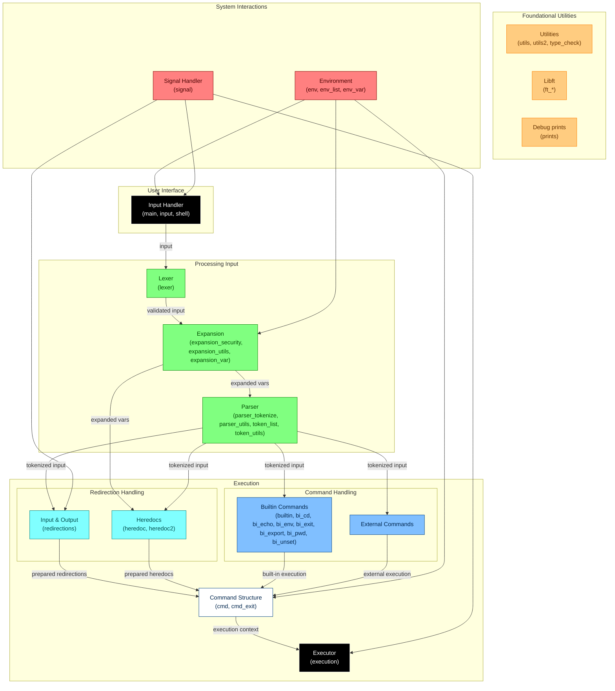

# minishell

[42-Cursus] Minishell is a minimalist shell implementation written in C, designed to mimic basic functionalities of a Unix shell like Bash. This project focuses on understanding processes, file descriptors, and shell operations such as command execution, redirections, pipes, and signal handling.  

Keywords  

- **Shell**
- **Process Management**
- **File Descriptors**
- **Redirections**
- **Pipes**
- **Signal Handling**
- **Built-in Commands**
- **Environment Variables**

---

## Index

- [Overview](#overview)
- [Features](#features)
- [Requirements](#requirements)
- [Flowchart](#flowchart)
- [How to Run](#how-to-run)
  - [Example Usage](#example-usage)
  - [Bonus Usage](#bonus-usage)
  - [Error Handling](#error-handling-and-testing)
- [What I Learned](#what-i-learned)
- [Authors](#authors)
- [Acknowledgments](#acknowledgments)

---

## Overview  

Minishell is a simplified Unix shell implementation created as part of the 42 Cursus curriculum. The project aims to deepen understanding of core operating system concepts such as process management, file descriptors, and shell operations. Minishell supports basic shell functionalities like command execution, input/output redirection, pipes, and environment variable management. It also handles signals like `ctrl-C`, `ctrl-D`, and `ctrl-\` similar to Bash.  

The project is written in C and adheres to strict coding standards, ensuring no memory leaks and robust error handling. Minishell is a great way to explore the inner workings of a shell and gain hands-on experience with low-level system programming.

---

## Features  

- **Command Execution**: Executes commands based on the `PATH` variable or using relative/absolute paths.
- **Input/Output Redirection**: Supports `<`, `>`, `<<`, and `>>` for input/output redirection.
- **Pipes**: Implements pipes (`|`) to connect the output of one command to the input of another.
- **Environment Variables**: Expands environment variables (e.g., `$HOME`) and `$?` for the exit status of the last command.
- **Signal Handling**: Handles `ctrl-C`, `ctrl-D`, and `ctrl-\` as in Bash.
- **Built-in Commands**: Implements built-ins like `echo`, `cd`, `pwd`, `export`, `unset`, `env`, and `exit`.
- **Quoting**: Handles single (`'`) and double (`"`) quotes to prevent interpretation of metacaracters.

## Bonus Features  (Not implemented)

- **Logical Operators**: Supports `&&` and `||` with parentheses for priority.
- **Wildcards**: Implements `*` wildcard for the current directory.

---

## Requirements  

- The project must be written in C and follow the 42 Norm.
- No memory leaks are allowed.
- The shell must handle signals correctly and manage file descriptors properly.
- The Makefile must compile the project with `-Wall`, `-Werror`, and `-Wextra` flags.
- The shell must support the mandatory features listed in the subject.

---

## Flowchart

Below is the flowchart representing the architecture and flow of the Minishell project.  
> **Note**: This flowchart is an approximation and may not represent the exact implementation details.



---

## How to Run  

1. Clone this repository:  

   ```bash  
   git clone [repository-url]  
   cd minishell  
   ```  

2. Compile the project:  

   ```bash  
   make  
   ```  

3. Run the shell:  

   ```bash  
   ./minishell  
   ```  

### Recommendations for Testing

- Use `valgrind` to check for memory leaks:  

  ```bash  
  valgrind --leak-check=full --show-leak-kinds=all --track-origins=yes --trace-children=yes --track-fds=yes./minishell 
  ```  

- Test with various commands, redirections, and pipes to ensure proper functionality.

### Parser Example

Input:

```C
cat < in | grep "Hi bye" | grep 'H' > out | cat >> final_out -e
```

Tokenizer result and classification:

- `"cat"`: command
- `"<"`: redir_in
- `"in"`: file_path
- `"|"`: op_pipe
- `"grep"`: command
- `"Hi bye"`: argument
- `"|"`: op_pipe
- `"grep"`: command
- `"H"`: argument
- `">"`: redir_out
- `"out"`: file_path
- `"|"`: op_pipe
- `"cat"`: command
- `">>"`: redir_append
- `"final_out"`: file_path
- `"-e"`: argument

### Example Usage

| **Input Command**       | **Description**                                                  | **Expected Output**                          |
|--------------------------|------------------------------------------------------------------|----------------------------------------------|
| `echo Hello World`       | Prints "Hello World" to the terminal.                           | `Hello World`                                |
| `ls -l`                 | Lists files in the current directory in long format.            | List of files in long format.                |
| `cat < file.txt`         | Reads content from `file.txt`.                                  | Content of `file.txt`.                       |
| `ls \| grep .c`           | Lists files and filters those ending with `.c`.                | Files ending with `.c`.                      |
| `export VAR=value`       | Sets an environment variable `VAR` to `value`.                 | No output, but `VAR` is set.                 |
| `cd /path/to/directory`  | Changes the current directory.                                  | No output, but directory changes.            |

### Bonus Usage

For bonus features, use the bonus rule in the Makefile:

   ```bash  
   make bonus
   ```  

| **Input Command**          | **Description**                                                    | **Expected Output**                     |
|----------------------------|--------------------------------------------------------------------|-----------------------------------------|
| `ls *.c`                   | Lists all `.c` files in the current directory.                    | List of `.c` files.                     |
| `echo Hello && echo World` | Executes `echo Hello` and `echo World` sequentially.              | `Hello` followed by `World`.            |
| `echo Hello \|\| echo World` | Executes `echo Hello` and skips `echo World` if the first succeeds.| `Hello` only.                           |

### Error Handling and Testing

| **Input Command**          | **Description**                                               | **Expected Output**                     |
|----------------------------|---------------------------------------------------------------|-----------------------------------------|
| `cat nonexistent_file`     | Attempts to read a non-existent file.                         | `Error: No such file or directory`      |
| `cd /invalid/path`         | Attempts to change to an invalid directory.                   | `Error: No such file or directory`      |
| `echo "Unclosed quote`     | Attempts to execute a command with an unclosed quote.         | `Error: Unclosed quote`                 |

## What I Learned  

- **Process Management**: Gained a deeper understanding of how processes are created and managed using `fork`, `execve`, and `waitpid`.
- **File Descriptors**: Learned how to manipulate file descriptors for input/output redirection and piping.
- **Signal Handling**: Implemented signal handling for `ctrl-C`, `ctrl-D`, and `ctrl-\`.
- **Environment Variables**: Managed environment variables and their expansion in commands.
- **Error Handling**: Developed robust error handling to manage invalid commands, file operations, and memory allocation.

---

## Authors  

| **Name**                  | **GitHub Profile**                                     | **42 Login**  |
|---------------------------|-------------------------------------------------------|---------------|
| **Oliver King Zamora**    | [oliverkingz](https://github.com/oliverkingz)  | **ozamora-**  |
| **Raúl José Pérez Medina**| [RaulPerezDEV](https://github.com/RaulPerezDEV)| **raperez-**  |

---

## Acknowledgments  

This project is part of the **42 Cursus**, a rigorous programming curriculum that emphasizes hands-on learning and problem-solving. Special thanks to the 42 team for providing this challenging and rewarding project!  
Also thanks to peers and mentors for their feedback and support during the development process.

- **42 Community**: For the collaborative environment and peer reviews.
- **Bash**: Used as a reference for shell behavior and functionality.
