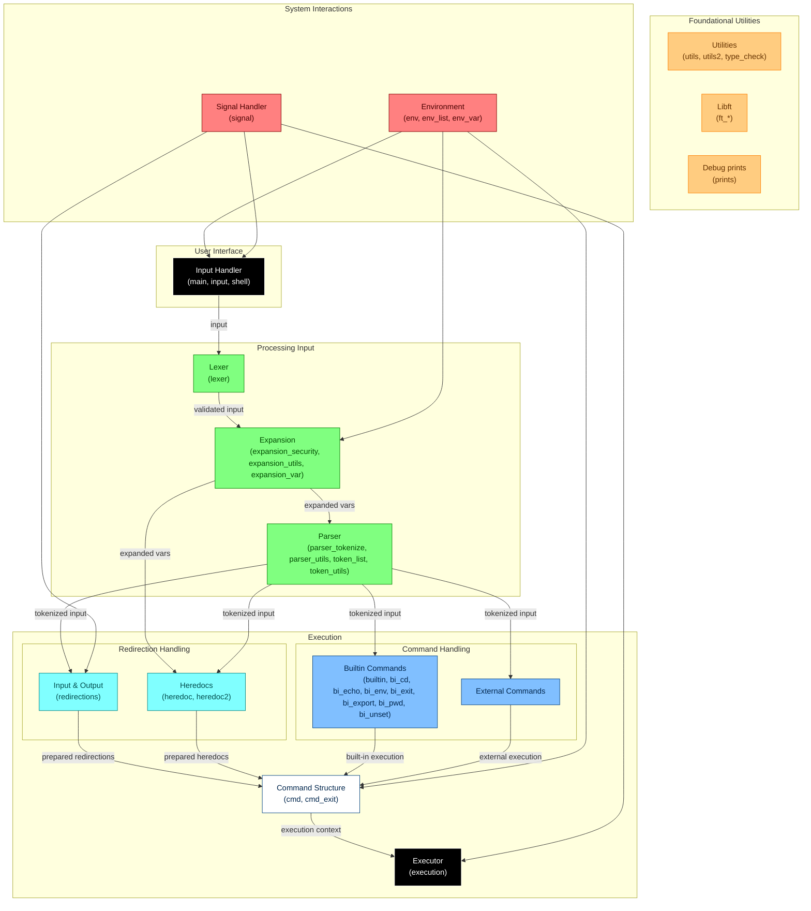

```mermaid
graph TB
    direction TB

    subgraph "User Interface"
        Input["Input Handler
        (main, input, shell)"]:::black
    end

    subgraph "Processing Input"
        Lexer["Lexer
        (lexer)"]:::green  
        Expansion["Expansion
        (expansion_security, expansion_utils, expansion_var)"]:::green
        Parser["Parser
        (parser_tokenize, parser_utils, token_list, token_utils)"]:::green
    end

    subgraph "Execution"
        subgraph "Redirection Handling"
            Redirection["Input & Output
            (redirections)"]:::turquoise
            Heredocs["Heredocs
            (heredoc, heredoc2)"]:::turquoise
        end
        subgraph "Command Handling"
            Builtin["Builtin Commands
            (builtin, bi_cd, bi_echo, bi_env, bi_exit, bi_export, bi_pwd, bi_unset)"]:::blue
            External["External Commands"]:::blue
        end
        Command["Command Structure
        (cmd, cmd_exit)"]:::dark_blue
        Executor["Executor
        (execution)"]:::black
    end

    subgraph "Foundational Utilities"
        Utility["Utilities
        (utils, utils2, type_check)"]:::orange
        Libft["Libft
        (ft_*)"]:::orange
        Debug["Debug prints
        (prints)"]:::orange
    end

    subgraph "System Interactions"
        Env["Environment
        (env, env_list, env_var)"]:::red
        Signal["Signal Handler
        (signal)"]:::red
    end

    Input       -->|"input"| Lexer
    Lexer       -->|"validated input"| Expansion
    Expansion   -->|"expanded vars"| Parser & Heredocs
    Parser      -->|"tokenized input"| Redirection
    Parser      -->|"tokenized input"| Heredocs
    Parser      -->|"tokenized input"| Builtin
    Parser      -->|"tokenized input"| External
    Redirection -->|"prepared redirections"| Command
    Heredocs    -->|"prepared heredocs"| Command
    Builtin     -->|"built-in execution"| Command
    External    -->|"external execution"| Command
    Command     -->|"execution context"| Executor

    Env --> Input
    Env --> Expansion
    Env --> Command
    Signal --> Input
    Signal --> Redirection
    Signal --> Executor

    classDef white fill:#ffffff,stroke:#000000,stroke-width:1px,color:#000000;
    classDef black fill:#000000,stroke:#ffffff,stroke-width:1px,color:#ffffff;
    classDef green fill:#80ff80,stroke:#008000,stroke-width:1px,color:#004d00;
    classDef blue fill:#80bfff,stroke:#004080,stroke-width:1px,color:#00264d;
    classDef dark_blue fill:#ffffff,stroke:#004080,stroke-width:1px,color:#00264d;
    classDef turquoise fill:#80ffff,stroke:#008080,stroke-width:1px,color:#004d4d;
    classDef orange fill:#ffcc80,stroke:#ff8000,stroke-width:1px,color:#663300;
    classDef red fill:#ff8080,stroke:#800000,stroke-width:1px,color:#4d0000;
```
